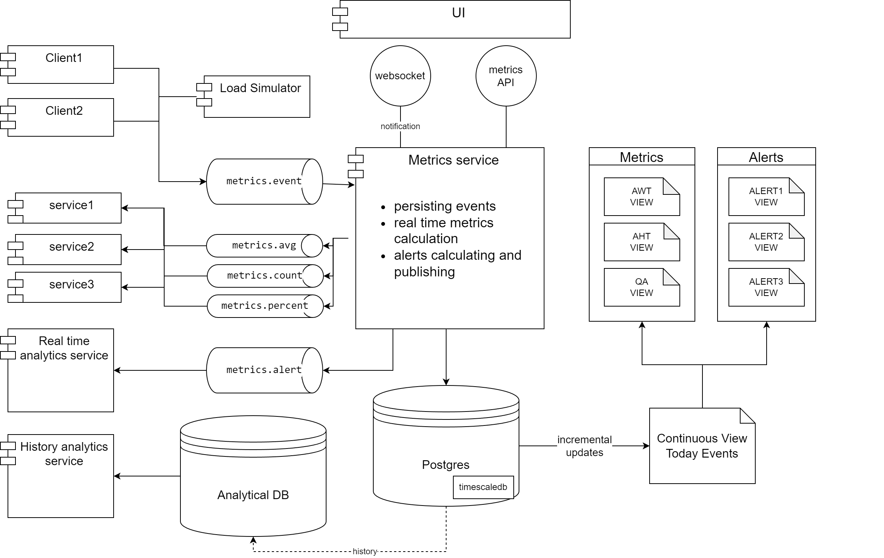

# otus-highload-final-project

**Итоговый проект**: _Рекомендательная система для высоконагруженного многоканального коммуникационного центра с
различными уровнями нагруженности по количеству операторов_

### Введение

В большинстве проектах связанных с технической поддержкой конечных пользователей возникает проблема оценки качества
работы операторов. Задача усложняется если КЦ поддерживает множество каналов коммуникации, включая голосовые каналы (
телефония), неголосовые (телеграмм, вконтакте, др. мессенджеры), личные кабинеты пользователя, возможно Email канал
также
стоит выделить в отдельный поскольку он имеет некоторую специфику, отличающую его от других мессенджеров. Зачастую
требуется получить отчет по типичным SLA метрикам таким как AWT, AHT, QA etc. некоторые метрики нужно получать в режиме
близком к реальному времени real time, отображая метрики на каком-нибудь дашборде доступном для супервайзера, чтобы
вовремя отреагировать например на возросший поток обращений и добавить дополнительных операторов в смену. Стоит
отметить,
что нагрузка на БД, которая будет хранить метрики существенно зависит от количества работающих операторов и должна быть
оптимизирована на запись. В то же время получение SLA-метрики в режиме почти real-time также накладывает определенные
ограничения/требования на БД, что потребует компромиссных решений.
В данном проекте предлагается решение для высоконагруженного многоканального КЦ с возможностью выдавать рекомендации для
супервайзера в режиме близком к реальному времени. В зависимости от размеров КЦ предлагается градация на 3 тира. На
каждом тире будет использоваться своя БД: чем выше тир, тем более специфичная БД и тем больше требований к железу и
стоимости решения.

### Оценка нагруженности КЦ

При поверхностной оценке коммуникационных и кол-центров предлагается разделение на 3 тира по количеству
одновременно работающих операторов. Разделение условное и может гибко варьироваться:

1) 1-60
2) 61-240
3) 241-1000+

Проведем оценку возможной нагрузки на количество генерируемых одним операторов событий связанных с обращением клиента (
открытие, закрытие, перевод и т.д.). Один оператор на голосовом канале физически не может поддерживать более 1го клиента
одновременно. В случае неголосового канала, максимально возможное количество одновременно поддерживаемых клиентов, без
потери качества обслуживания - не более 3х. Соответственно, в качестве верхней оценки возьмём неголосовые каналы. 1
клиент обычно генерирует в среднем от 3х событий в минуту, соответственно на 1го оператора приходится не более 9 событий
в
минуту. Округляя в большую сторону получаем, что 1 оператор генерирует порядка 10 событий в минуту, что соответствует 1
событию в 6 секунд. Также стоит отметить что количество генерируемых событий от одного клиента может варьироваться в
большую сторону если мы хотим отслеживать статистику более детализированно. Соответственно разделение КЦ по нагрузке в
терминах RPS преобразуется следующим образом:

1) до 10 событий в секунду
2) до 40 событий в секунду
3) до 150 событий в секунду и выше

При выборе подходящего хранилища событий следует также учитывать, что при продолжительном использовании размер БД растет
стремительно, и необходимая скорость вставки при существенной наполненности может существенно отличаться от скорости в
пустой БД. Оценим объем событий генерируемых каждым тиром КЦ в течении недели, месяца, года:

за неделю:

1) 10 * 60 * 60 * 24 * 7 = 6 048 000
2) 40 * 60 * 60 * 24 * 7 = 24 192 000
3) 150 * 60 * 60 * 24 * 7 = 90 720 000

Очевидно, что даже при самом маленьком тире КЦ наполнение БД происходит очень быстро и соотвественно нужно выбирать
целевую БД, которая не зависит от существующего объема или периодически архивировать собранные события. Учитывая, что
обычно требуется быстрая аналитика по метрикам почти в реальном времени, то архивирование событий старше недели видится
вполне логичной стратегией. Стоит отметить, что не стоит удалять события, а лучше перекладывать в подходящую
аналитическую БД для возможного последующего анализа метрик по более долгоиграющему срезу (недели, месяцы, года)

### Выбор и обоснование БД под каждый тир

На основании сделанных верхнеуровневых оценок предлагается следующий выбор БД для сохранения событий.

1) Ванильный Postgres
2) TimescaleDB
3) ClickHouse

1) При маленьком количестве операторов следует избегать преждевременной оптимизации на не критически важные элементы
   инфраструктуры. Не получить рекомендацию/алерт не так важно как потерять транзакцию с переводом финансов. Поэтому для
   тира 1 с помощью стандартного Postgres, с учетом использования своевременного архивирования исторических событий,
   можно получить желаемую производительность, не вкладываясь в незнакомые инструменты или дополнительное железо.
2) В качестве БД для тира 2 предлагается использовать плагин для postgres - TimescaleDB. Это специализированное для
   хранения timeseries данных расширение Postgres, что автоматически дает знакомый инструмент SQL и безшовную миграцию
   данных при превышении возможностей тира 1. В дополнение к стандартным возможностям реляционных данных TimescaleDB за
   счет автоматического партицирования (шардирования?) своих гипертаблиц позволяет получать константное время вставки,
   там где стандартный postgres деградирует на порядки величин. Плюс в TimescaleDB оптимизировано хранение временных
   рядов, что делает его идеальным кандидатом на тир
    2. https://www.timescale.com/blog/postgresql-timescaledb-1000x-faster-queries-90-data-compression-and-much-more/
       
3) В случае экстремальных значений RPS на вставку требуется использовать специализированный инструмент. Лидером рынка
   здесь является ClickHouse. Благодаря тому, что на предыдущих тирах использовался всем известный стандарт в мире
   реляционных данных - postgres, то миграция с тира 1 или 2 на 3й представляется безпроблемной. Однако стоит отметить,
   что ClickHouse имеет свою специфику и при неправильном использовании можно получить деградацию производительности по
   сравнению с TimescaleDB. Например стоит учитывать, что ClickHouse ожидает вставки данных большими пачками и сильно
   проседает при вставках по одной записи
   https://www.timescale.com/blog/what-is-clickhouse-how-does-it-compare-to-postgresql-and-timescaledb-and-how-does-it-perform-for-time-series-data/
   
   

### Почему не прометей

Зачастую при упоминании слова "метрики" автоматически всплывает ассоциация со стандартом в мире снятия метрик -
Prometheus. Почему в данном случае он не является целевым решением? Главная причина фундаментальна и связана со способом
получения метрик от целевых сервисов. Прометей использует Pull модель, т.е. он с определенной периодичностью опрашивает
сервисы, которые с фиксированных эндпоинтов отдают метрики, сохраняя в специализированном хранилище. Для отображения
метрик существует также стандартный инструмент для связки с Прометеем - Графана. К сожалению пул модель, которая
идеально подходит для снятия инфраструктурных метрик (и помогает не захлебнуться под огромным потоком данным от всех
публикующих сервисов), не подходит (или подходит с существенными ограничениями) для сохранения бизнес метрик. При
сохранении бизнес метрик нам важно точное время события без усреднения или округления, такие события могут быть очень
нерегулярными. Теоретически мы можем максимально уменьшить время дискредитации (scraping time) прометея, чтобы он
гарантированно не пропустил или не округлил время
события. https://last9.io/blog/downsampling-aggregating-metrics-in-prometheus-practical-strategies-to-manage-cardinality-and-query-performance/
Однако Прометей сохраняет в каждый момент времени не инкремент, а последнее сумарное значение счетчика (делает он чтобы
в случае если метрика не долетела по техническим причинам, это бы не отразилось в конечном итоге). Поэтому в случае
очень разреженного и неравномерного распределения метрик будет сохраняться чрезмерно большое количество мусорных данных.
В случае push модели сохраняется только целевое событие в произвольный момент времени без необходимости его округлять
или приводить к моменту времени сбора данных.
К недостаткам Прометея можно отнести:

- необходимость настраивания долговременного хранилища, зачастую в качестве оного предлагается использовать тот же
  TimescaleDB
- не скалируется горизонтально из коробки без дополнительных инструментов
- поскольку предполагается выосконагруженным, то нужно либо поднимать дополнительный стенд либо получаем риск падения на
  стенде где снимаются инфраструктурные метрики https://habr.com/ru/articles/441136/
- встроенный в Прометей язык запросов PromQL объективно уступает по распространенности SQL, что является порой ключевой
  характеристикой при поиске специалистов по поддержке решения.
  Помимо всего Графана не подходит в качестве пользовательского интерфейса для конечного не технического пользователя, а
  подключения фронта к Прометею не является стандартной и тривиальной задачей.
  Prometheus is not intended as a general-purpose time series database and might not be the best choice for high
  cardinality or long-term data storage.

### Другие инструменты

* InfluxDb - очень специализированный язык запросов
* ElasticSearch/OpenSearch - идеальны для полнотекстового поиска, не оптимизирован для хранения такого большого объема
  данных, индексы будут распухать

### Рекомендации по выбору тира

Для большинства случаев рекомендуется выбирать тир 2, поскольку он вполне конкуретно способен по скорости вставки с
ClickHouse, но не требует расширение технологического стека за пределы реляционных БД и более лоялен к характеристикам
железа. Тир 1 предлагается выбирать только если есть сверх серьезные внутренние ограничения на расширение техстека,
иногда даже плагин для postgres является проблемой. Также следует учитывать лицензионные ограничения накладываемые
плагином

### Описание SLA метрик

SLA — это абстрактное понятие, которое строится из множества конкретных метрик и показывает как хорошо настроены
процессы и на сколько пользователи удовлетворены сервисом https://habr.com/ru/companies/avito/articles/742960/
Важно чтобы метрики считались для конкретного подразделения. Время работы HelpDesk плохая метрика для Support, потому
что зависит от доступности железа, которое не под контролем оцениваемых https://habr.com/ru/articles/336868/
Наша задача как продукта — собрать как можно больше измерений, по которым в последствии можно построить максимально
гибкие метрики

- AWT(AverageWaitingTime) = APPEAL_SENT_DISTRIBUTION - APPEAL_APPOINTED
- AHT(AverageHandleTime) = APPEAL_APPOINTED - APPEAL_CLOSED
- QA(QueuedAppeals) = count (APPEAL_NEW || APPEAL_RETURNED)  AND NOT APPEAL_CLOSED
- AA(AcceptedAppeals) = count (APPEAL_APPOINTED || APPEAL_CLOSED) AND NOT APPEAL_MISSED
- HA(HandledAppeals) = count (APPEAL_CLOSED)  AND NOT APPEAL_MISSED

### Алерты/Рекомендации

Примером Алерта, который может быть полезен при работе ком-центра является уведомление в топик об обращениях, которые
зависли в необработанном статусе сверх определённого порога. Это может быть технической проблемой или свидетельствовать
о перегруженности операторов. В любом случае это сигнал, на который должен реагировать супервайзер

### Архитектура проекта

#### Компонентная схема

#### Функциональные требования

* сохранять события от разных сервисов без потери точности оригинальных данных за счет усреднения или другой
  предварительной обработки данных
* уметь агрегировать события по каналам, пользователям и другим произвольным параметрам и строить статистику в режиме
  близкой к real-time
* публиковать метрики разного типа заинтересованным сервисам через кафку и websocket
* предоставлять АПИ для получения метрик
* архивировать исторические данные для последующего более глубокого анализа
* публиковать алерты о критически важных превышениях каких-либо порогов
* уметь валидировать корректность расчета посредством подачи эталонной нагрузки с известной статистикой через АПИ
  ендпоинт или через специальный сервис симулятор

#### Highload/performance/нефункциоанльные

* сервис должен быть устойчив к высокой неравномерной нагрузке - за частую события очень разрежены или наоборот плотно
  сгруппированы
* получение оригинальных событий, а также вычисленных метрик и алертов потребителям должна быть асинхронной
* вычисление метрик должна быть близкой к real-time
* объем данных может быть гигантским, но вычисление метрик обычно имеет смысл в течении текущего, максимум предыдущего
  дня
* анализ исторических данных не должен вычислять в этом сервисе, потому что нагрузка на слишком тяжелые запросы не даст
  возможности вычислять метрики оперативно

#### Устойчивость к падениям/Fault tolerance

* устойчивость к падениям решается стандартно - через поднятие нескольких инстансов приложений, а также использование
  кафки в качестве транспорта
* Хранилище данных - Postgres также должно быть реализовано в fault tolerance режиме

#### Устойчивость к бизнес изменениям

* немаловажным является гибкость при добавлении новых событий и метрик, которые нужны бизнесу. Для этого предлагается
  реализовать хранилище событий максимально простым, где тип события путем примитивом, причем имеет смысл разделять
  разные группы событий по значительному пробелу в порядке идентификаторов. Например все события для звонка начинаем с
  100, события для телеграмма с 200. Таким образом при возможных неучтенных событиях в начале разработки, всегда можно
  добавить новое не перемешивая их с другой группой событий, что существенно упростит восприятие.
* Также использование примитивов в качестве идентификаторов событий поможет при добавлении новых типов событий от
  источников. Даже если в момент миграции сервис метрик еще не знает это событие это не помешает ему сохранить его для
  последующего анализа

#### Тестовая нагрузка

* стоит отметить, что немаловажным является тестирование корректности расчитываемых метрик. Для этого предлагается
  использовать тестовый сервис нагрузки с которого можно подать в любой момент нагрузку с известной эталонной
  статистикой и на выходе получить сравнение с заранее расчитанным результатом. Следует учесть невалидность данных и
  возможные слишком широкие окна расчета

### Заключение

Представленное решение может использоваться не только коммуникационными центрами, но и любыми департаментами, для
которых
необходимо расчитывать SLA метрики в режиме близком к real-time. В зависимости от размеров департамента и генерируемого
потока событий можно выбрать разные тиры решений. Переход от тиров происходит безшовно и позволяет не вкладываться в
инфраструктуру на первых этапах. Немаловажным является простота поддержки, поскольку первые 2 тира используют наиболее
распространненый инструмент - SQL
